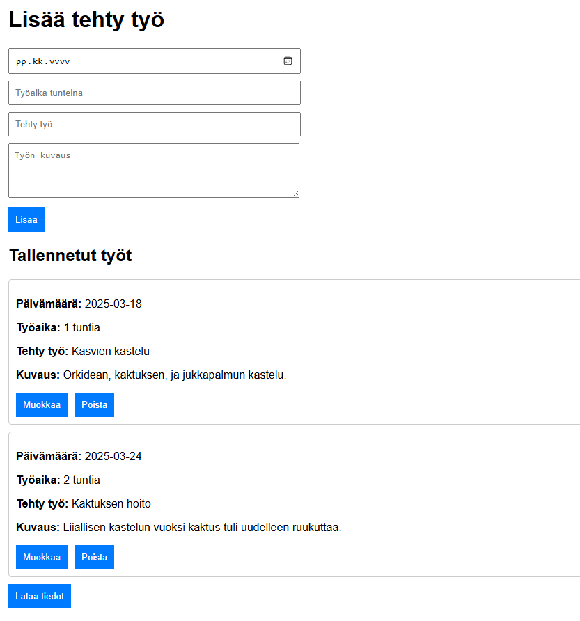

# Project phase 1

Tässä dokumentissa määritellään sivuston ominaisuuksia ja toimintoja 

## 1. Käyttäjäpersoonat:

| Käyttäjä         | Persoona     | Tavoite                                                                                              | Halutut toiminnot                            | Käyttäytyminen                                                 |
| :--------------- | :----------- | :--------------------------------------------------------------------------------------------------- | :------------------------------------------- | -------------------------------------------------------------- |
| Otto oppija      | Opiskelija   | Kirjata ylös tehtyjä töitään, tarkastella ja ladata annettuja tietoja                                | Tarkasella syötettyjä tietoja.               | Lisää säännöllisesti tietoa ja muuttaa sitä usein              |
| Maria Makia      | Harrastelija | Haluaa pitää kirjaa puutarhan hoidosta, jotta voi tarkastella onnistumisia ja epäonnistumisen syitä. | Sivun helppokäyttöisyys.                     | Satunnainen käyttäjä, joka listää paljon tietoa kerralla.      |
| Taneli Työläinen | Ohjelmoija   | Sivusto, jonne voi syöttää tehsyjä töitä ja ladata ne valmiiksi oikeaan muotoon.                     | Ladata tietokanta MD formaattiin taulukkona. | Käyttää sivustoa usein ja lisää paljon tietoa pienissä erissä. |

## 2. Käyttötapaukset.

| Tapaus                 | Kuvaus                                                                                               | Esimerkki                                                                                                                              |
| :--------------------- | ---------------------------------------------------------------------------------------------------- | -------------------------------------------------------------------------------------------------------------------------------------- |
| Tiedon lisääminen.     | Käyttäjä täyttää lomakkeen, jossa on päivämäärä, käytty aika, tehty työ/toiminta ja tehtävän kuvaus. | Otto oppija haluaa lisätä käytetyn työn kirjaukseen.                                                                                   |
| Tietojen tarkastelu.   | Käyttäjä kykenee näkemään tiedot sivustolta suoraan.                                                 | Maria Makian orkidea tiputti lehdet ja hän sivutolle tullessaan näkee millon hän on kasviaan viimeksi kastellut.                       |
| Tietojen muokkaaminen. | Kirjattuja tietoja tulee kyetä muokkaamaan.                                                          | Otto opiskelija päättikin jatkaa keskenäistä tehtävää samana päivänä ja hän haluaa lisätä tehdyn työn määrää ja kuvausta tietokantaan. |
| Tietojen poistaminen.  | Käyttäjän tulee kyetä poistaa tietoa.                                                                | Maria Makian kasvi on kuollut ja hän on hankkinut uuden. vanhat tiedot olisi hyvä poistaa ja aloittaa tietokanta alusta.               |
| Tietojen lataaminen.   | Käyttäjä voi ladata tietokannan MD formaatissa.                                                      | Otto oppija haluaa lisätä tiedot GitHubiin ja hän lataa sivustolta MD tiedoston, jossa tietokanta on.                                  |

## 3. Prototyyppi. 

Prototyypin tärkeimmät ominaisuudet:
- Neljä kenttää, jossa on päivämäärä, työn määrä, lyhyt kuvaus työstä ja tarkka kuvaus työstä.
- Lisää näppäin joka laittaa annatun tiedon tietokantaan.
- Listaus tehdyistä töistä joissa nähdään sisältö.
- Kyky muokata tietoa.
- Kyky poistaa tietoa. 
- Käyttäjällä on mahdollisuus ladata tietoa.
- Painikkeiden kuvaukset ovat selkeitä ja intuitiivisia. 
- Sivuston tulee olla responsiivinen erilaisia laitteita varten. 
- Sisuston värimaailman tulee olla selkeä näkörajoituksista huolimatta.
- Sivuston tulee olla reaktiivinien, jotta käyttäjä saa välittömän tiedon sivuston toiminnasta.
Päätökset sivuston ulkonäöstä ovat avoimia muutoksille. 

## 4.Tietoarkkitehtuuri ja tekninen suunnittelu.

1. Tietokannan Rakenne: 
	- Tietokanta sisältää seuraavat sarakkeet: ID, date, time, description ja definition.
2. Sivuston rakenne:
	- Etusivu, jossa toiminntot ovat saatavilla.
	- "Lisää" toiminto.
	- "Muokkaa" toiminto olemassa olevaan tietoon liittyen.
	- "Poista" toiminto olemassa olevaan tietoon liittyen.
	- "Lataa tiedot" joka lataa kaikki olemassa olevat tiedot laitteelle MD- muodossa.
Sivusto luodaan käyttämällä JavaScript ja React fronttia. Backend tulisi olla käyttämällä Express.
Sivuston tietokanta tulee olla MySQL- tietokantaa käyttämällä.
Sivustolla tulee olla CRUD toiminnot joiden avulla tietokannan hallinta on yksinkertaista.
Kehitys tulee tapahtua pilvipalvelussa(Google cloud), mutta ajankäytön puitteissa voidaan tyytyä virtuaalikoneen käyttöön.

## 5. Projektin hallinta.

Dokumentointiin käytän apuna Obsidian [Obsidian - Sharpen your thinking](https://obsidian.md/) muistiinpanotyökalua joka luo MD tiedoston. tämä tiedosto on hieman helpompi täyttää ja lopulta tieto lisätään paikallisen koneen VS-coden kautta GitHubiin. 

Projektin versionhallinnassa käytän GitHubia. 

Teen projektia yksin, joten ainoat dokumentaatioon käytettävät polut ovat opettajalle olevat:
1. Itslearning, tehtävien palautukseen GitHub- linkki
2. Sähköposti, jonka kautta viestin suoraan opettajan kanssa. 
3. Teams. Tämä on vaihtoehtoinen polku ottaa yhetyttä opettajaan. 

Jos tarvitsen tehtävien tekemisessä vertaistukea muilta oppilailta, käytän Discord palvelua.

## 6. Käyttäjätestaus.

Projektille luodaan yksikkötestejä jotka tarkastaa sivuston toimivuutta. Esimerkkejä:
1. tuplaklikkaus ei lisää tietokantaan useampaa arvoa.
2. poistaminen poistaa yhden arvon.
Lisäksi tulee olla käytettävyys testejä, joiden avulla tarkastellaan sivuston toimintoja manuaalisesti. Esimerkiksi:
3. Kuvaus joka on kovin pitkä ei mene ruudun ulkopuolelle.
4. Painikkeilla on responsiivisuus(painaessa painikkeen väri muuttuu)
End 2 End testaus. Luodaan testejä jotka simuloi käyttäjätilanteita. Esim
5. Testi luo arvon, tarkastaa sen olemassaolon, muokkaa sitä, tarkastaa muutoksen. poistaa tiedon ja tarkastaa tiedon poistumisen. 

## 7. Tiedon lataaminen

Projektin yksi tavoitteista olisi kyetä lataamaan tieto MarkDown muotoon valmiiksi taulukoksi, jotta GitHubiin työtuntien kirjaus olisi helpooa ja vaivatonta. Kuitenkin tämä toiminto on toissijainen ja mahdollisesti tiedon lataaminen ja sen latauksen muoto on alttiita muutoksille projektin aikana.